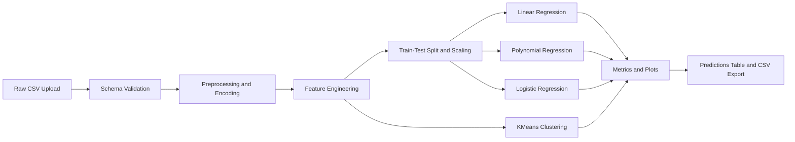

# Project: Student Performance Prediction & Analytics Dashboard

## From Exploratory Analysis to Multi-Model Decision Support

### Project Overview
This project designs and implements an AI-driven student analytics system that predicts exam performance and provides interpretable academic insights through an interactive dashboard.

- **Milestone 1 (Current):** Classical machine learning on historical student behavior and academic factors to predict `Exam_Score` and analyze risk patterns.
- **Milestone 2 (Planned Extension):** Agentic academic assistant that reasons over student risk profiles, retrieves intervention strategies (RAG), and generates structured support recommendations.

---

### Constraints & Requirements
- **Team Size:** 3-4 Students
- **API Budget:** Free Tier Only (open-source models / free APIs)
- **Framework:** LangGraph (recommended for Milestone 2)
- **Hosting:** Mandatory (Streamlit Cloud, Hugging Face Spaces, or Render)

---

### Technology Stack
| Component | Technology |
| :--- | :--- |
| **Data & Modeling (M1)** | Pandas, NumPy, Scikit-Learn |
| **Regression Models (M1)** | Linear Regression, Polynomial Regression |
| **Classification (M1)** | Logistic Regression (pass/fail thresholding) |
| **Clustering (M1)** | KMeans |
| **UI Framework** | Streamlit |
| **Visualization** | Matplotlib, Seaborn |
| **Agent Framework (M2)** | LangGraph + Vector Store (planned) |

---

### Milestones & Deliverables

#### Milestone 1: ML-Based Student Performance Prediction (Mid-Sem)
**Objective:** Predict student exam outcomes and generate actionable analytics using classical ML pipelines **without LLMs**.

**Key Deliverables:**
- Problem understanding and educational context.
- Working data preprocessing + feature engineering pipeline.
- Working local/hosted Streamlit application with upload and dashboard.
- Performance evaluation report (MSE, RMSE, MAE, R2, Accuracy/F1).

#### Milestone 2: Agentic Academic Support Assistant (End-Sem, Planned)
**Objective:** Extend the system into an agentic assistant that reasons about student risk and retrieves best-practice interventions.

**Key Deliverables:**
- Publicly deployed application link.
- Agent workflow documentation (states and nodes).
- Structured intervention report generation.
- GitHub repository with complete code.
- Demo video (max 5 minutes).

---

### Evaluation Criteria
| Phase | Weight | Criteria |
| :--- | :--- | :--- |
| **Mid-Sem** | 25% | ML implementation quality, feature engineering, UI usability, evaluation rigor |
| **End-Sem** | 30% | Reasoning quality, RAG + state management, output clarity, deployment success |

> [!WARNING]
> Localhost-only demonstrations are not accepted for final submission. The project must be hosted.

---

## Problem Statement
Educational outcomes are influenced by multiple factors beyond past marks alone, including attendance, motivation, support system, sleep patterns, and access to resources. This project predicts exam scores and profiles student segments to support early academic intervention.

---

## Dataset Description
- **Dataset:** `StudentPerformanceFactors.csv`
- **Rows/Columns:** 6607 rows, 20 columns
- **Target Variable:** `Exam_Score`
- **Feature Groups:**
  - Numerical: `Hours_Studied`, `Attendance`, `Sleep_Hours`, `Previous_Scores`, `Tutoring_Sessions`, `Physical_Activity`
  - Ordinal categorical: `Parental_Involvement`, `Access_to_Resources`, `Motivation_Level`, `Teacher_Quality`, `Family_Income`, `Parental_Education_Level`, `Peer_Influence`, `Distance_from_Home`
  - Binary categorical: `Extracurricular_Activities`, `Internet_Access`, `Learning_Disabilities`
  - Nominal categorical: `School_Type`, `Gender`

---

## EDA Summary
Key EDA and diagnostics from `main.ipynb` include:
- Missing-value and duplicate checks.
- Target distribution analysis for `Exam_Score`.
- Correlation analysis between numerical features and target.
- Categorical impact analysis via grouped means.
- Outlier detection using IQR method.

---

## Methodology
### 1. Data Preprocessing
- Missing values:
  - Categorical features: mode imputation
  - Numerical features: median imputation
- Outlier treatment:
  - IQR capping (winsorization) for selected numerical features
  - Logical clipping of `Exam_Score` to `[0, 100]`
- Encoding:
  - Ordinal mapping for ordered categories
  - Binary mapping for yes/no fields
  - One-hot encoding for `School_Type` and `Gender` (drop-first)

### 2. Feature Engineering
The following derived features are created:
- `Study_Effort`
- `Attendance_Score`
- `Support_System`
- `Optimal_Sleep`
- `High_Intensity_Study`
- `Risk_Factor`

### 3. Model Training
The Streamlit app recreates the full pipeline from raw CSV and trains four models:
- Linear Regression (continuous score prediction)
- Polynomial Regression (degree 2, comparison baseline)
- Logistic Regression (pass/fail classification using configurable threshold)
- KMeans (student segmentation into 3 clusters)

---

## Baseline Results (Default App Config)
Configuration: `test_size=0.2`, `pass_threshold=60`

### Regression Metrics
| Model | MSE | RMSE | MAE | R2 |
| :--- | :---: | :---: | :---: | :---: |
| Linear Regression | 3.2507 | 1.8030 | 0.4530 | 0.7700 |
| Polynomial Regression (deg 2) | 3.4585 | 1.8597 | 0.6231 | 0.7553 |

### Classification Metrics (Logistic)
| Accuracy | Precision | Recall | F1 |
| :---: | :---: | :---: | :---: |
| 0.9985 | 0.9992 | 0.9992 | 0.9992 |

### Interpretation
- Linear Regression provides stronger generalization than Polynomial Regression for this dataset.
- Polynomial expansion increases complexity but does not improve predictive quality.
- Logistic performance is very high under the selected threshold, indicating clear class separability in engineered feature space.

---

## Streamlit App Features
- Raw CSV upload and strict schema validation.
- End-to-end preprocessing and feature engineering.
- Four-model training in one run.
- Dashboard tabs:
  - Preprocessing
  - Model Metrics
  - Clusters
  - Predictions
- Downloadable predictions file: `student_predictions_4_models.csv`

---

## System Architecture


---

## Repository Structure
```text
.
|-- app.py
|-- main.ipynb
|-- StudentPerformanceFactors.csv
|-- requirements.txt
|-- test.py
|-- models/
|   |-- linear.pkl
|   |-- polynomial.pkl
|   |-- logistic.pkl
|   |-- kmeans.pkl
|-- README.md
```

---

## Installation & Local Run
```bash
python -m venv .venv
source .venv/bin/activate
pip install -r requirements.txt
streamlit run app.py
```

---

## Deployment (Mandatory)
### Option 1: Streamlit Community Cloud
1. Push this repository to GitHub.
2. Create a new Streamlit app from the repo.
3. Set entry file to `app.py`.
4. Deploy and submit the public URL.

### Option 2: Hugging Face Spaces (Streamlit SDK)
1. Create a new Space.
2. Upload repository files.
3. Ensure `requirements.txt` is present.
4. Deploy and share public URL.

### Option 3: Render
1. Create a new web service from the repository.
2. Use a Streamlit start command.
3. Deploy and submit public URL.

---

## Submission Readiness Checklist
This checklist maps your faculty form requirements:

### 1) Team & Technical Integrity
- Add all team member details and batch in submission form.
- Confirm code ownership and understanding of core logic.
- Ensure at least 3 distinct technical sub-features are clearly documented.

### 2) GitHub & Code Quality
- Keep commit history clear and meaningful.
- Maintain this professional README.
- Ensure every member can explain any major function during viva.

### 3) Report Requirements
Include:
- Problem statement
- Data description
- EDA findings
- Methodology and algorithm choices
- Evaluation metrics and analysis
- Optimization decisions
- Team contribution breakdown

### 4) Deployment & Media
- Add live hosted URL (no localhost links).
- Add high-resolution demo video with clear audio.

### 5) Viva Preparation
Be ready to explain:
- End-to-end architecture
- Why selected models were chosen
- Tooling details (Pandas, Scikit-Learn, Streamlit, Matplotlib/Seaborn)

---

## Team Contribution (Fill Before Final Submission)
- Member 1: Data understanding and EDA
- Member 2: Preprocessing and feature engineering
- Member 3: Model development and evaluation
- Member 4: Streamlit UI, deployment, and documentation

---

## Notes
- The hosted app intentionally retrains models from uploaded raw CSV to avoid serialized-model compatibility issues across environments.
- If dataset categories differ from expected mappings, the app will fail fast with explicit schema/category errors.
